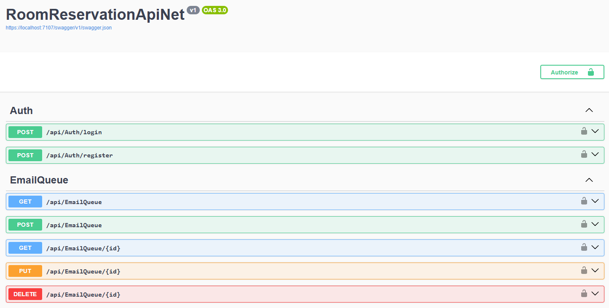
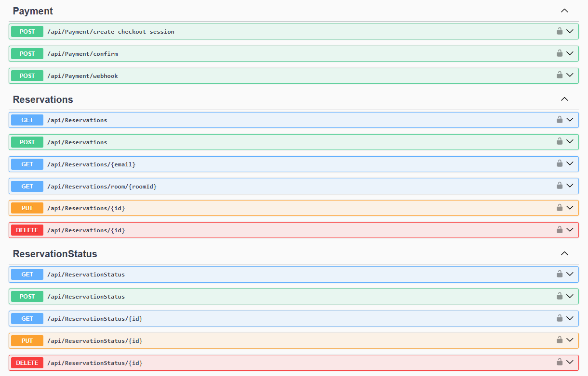
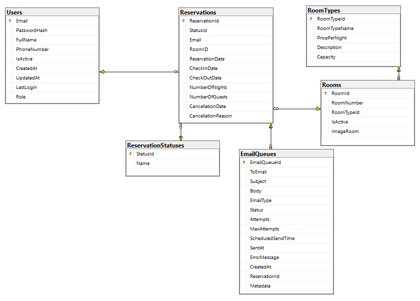

# RoomReservationApiNet

API for managing room reservations with ASP.NET Core 8 and SQL Server.

## Features And Technologies Used
- ASP.NET Core 8 Web API
- Entity Framework Core
- SQL Server
- JWT Authentication
- Brevo for sending emails
- Stripe as a payment gateway
- Background Services for scheduled tasks
- Swagger for API documentation
- CRUD for users and reservations
- Email queue system (confirmations, reminders)
- Availability validations
- Advanced error handling

<kbd>
  
</kbd>
<kbd>
  
</kbd><kbd>
  
</kbd>

RoomReservationApiNet/  
├── Controllers/  
│ ├── AuthController.cs  
│ ├── EmailQueueController.cs  
│ ├── PaymentController.cs  
│ ├── ReservationsController.cs  
│ ├── ReservationStatusController.cs  
│ ├── RoomController.cs  
│ ├── RoomTypeController.cs  
│ └── UsersController.cs  
├── Data/  
│ ├── AppDbContext.cs  
├── DTOs/  
│ ├── CheckoutSessionResponseDTO.cs  
│ ├── CreateCheckoutSessionDTO.cs  
│ ├── CreateEmailQueueDTO.cs  
│ ├── CreateReservationDTO.cs  
│ ├── CreateReservationStatusDTO.cs  
│ ├── CreateRoomDTO.cs  
│ ├── CreateRoomTypeDTO.cs  
│ ├── CreateUserDTO.cs  
│ ├── EmailQueueDTO.cs  
│ ├── LoginRequestDTO.cs  
│ ├── LoginResponseDTO.cs  
│ ├── RegisterRequestDTO.cs  
│ ├── ReservationDTO.cs  
│ ├── ReservationStatusDTO.cs  
│ ├── RoomDTO.cs  
│ ├── RoomTypeDTO.cs  
│ ├── UpdateEmailQueueDTO.cs  
│ ├── UpdateReservationStatusDTO.cs  
│ ├── UpdateRoomDTO.cs  
│ ├── UpdateRoomTypeDTO.cs  
│ ├── UpdateUserDTO.cs  
│ └── UserDto.cs  
├── Helpers/  
│ ├── AuthHelpers.cs  
│ ├── EmailQueueHelpers.cs  
│ └── ReservationHelpers.cs  
├── Middleware/  
│ ├── ErrorHandlingMiddleware.cs  
├── Models/  
│ ├── DatabaseSettings.cs    
│ ├── EmailQueue.cs  
│ ├── Reservation.cs  
│ ├── ReservationStatus.cs  
│ ├── Room.cs  
│ ├── RoomType.cs  
│ ├── StripeSettings.cs  
│ └── User.cs  
├── Repository/  
│ ├── IReservationRepository.cs  
│ ├── IReservationStatusRepository.cs  
│ ├── IRoomRepository.cs  
│ ├── IRoomTypeRepository.cs  
│ ├── IUserRepository.cs  
│ ├── ReservationRepository.cs  
│ ├── ReservationStatusRepository.cs  
│ ├── RoomRepository.cs  
│ ├── RoomTypeRepository.cs  
│ └── UserRepository.cs  
├── Services/  
│ ├── AuthService.cs  
│ ├── EmailQueueService.cs  
│ ├── EmailService.cs  
│ ├── IEmailQueueService.cs  
│ ├── IReservationService.cs  
│ ├── IReservationStatusService.cs  
│ ├── IRoomService.cs  
│ ├── IRoomTypeService.cs  
│ ├── IStripeService.cs  
│ ├── IUserService.cs  
│ ├── ReservationService.cs  
│ ├── ReservationStatusService.cs  
│ ├── RoomService.cs  
│ ├── RoomTypeService.cs  
│ ├── StripeService.cs  
│ └── UserService.cs  
├── appsettings.json  
└── Program.cs

## Requirements

- .NET 8 SDK
- SQL Server (default), MySQL, PostgreSQL, SQLite, or MongoDB
  
## Program

```cs
// =========================
// DATABASE CONFIG
// =========================
var databaseSettings = builder.Configuration.GetSection("DatabaseSettings").Get<DatabaseSettings>() ?? throw new InvalidOperationException("Database settings are not configured.");

switch (databaseSettings.Provider)
{
    case "SqlServer":
        builder.Services.AddDbContext<AppDbContext>(options =>
            options.UseSqlServer(databaseSettings.ConnectionStrings.SqlServer));
        break;
    case "MySQL":
        builder.Services.AddDbContext<AppDbContext>(options =>
            options.UseMySql(databaseSettings.ConnectionStrings.MySQL, ServerVersion.AutoDetect(databaseSettings.ConnectionStrings.MySQL)));
        break;
    case "PostgreSQL":
        builder.Services.AddDbContext<AppDbContext>(options =>
            options.UseNpgsql(databaseSettings.ConnectionStrings.PostgreSQL));
        break;
    case "SQLite":
        builder.Services.AddDbContext<AppDbContext>(options =>
            options.UseSqlite(databaseSettings.ConnectionStrings.SQLite));
        break;
    case "MongoDB":
        // MongoDB-specific configuration
        break;
    default:
        throw new ArgumentException("Unsupported database provider");
}

```

## Database Configuration

The application supports multiple database providers: SQL Server (default), MySQL, PostgreSQL, SQLite, and MongoDB. To change the database provider, update the `DatabaseSettings` section in `appsettings.json`:

## appsetting.json

```json
"DatabaseSettings": {
  "Provider": "SqlServer", // Change to MySQL, PostgreSQL, SQLite, or MongoDB
  "ConnectionStrings": {
    "SqlServer": "Server=W11P0RT;Database=RoomReservationDb;Trusted_Connection=True;TrustServerCertificate=True;MultipleActiveResultSets=True",
    "MySQL": "Server=localhost;Database=RoomReservationDb;User=root;Password=password;",
    "PostgreSQL": "Host=localhost;Database=RoomReservationDb;Username=postgres;Password=password;",
    "SQLite": "Data Source=RoomReservationDb.db;",
    "MongoDB": "mongodb://localhost:27017/RoomReservationDb"
  }
}
```

## Installation and Execution

1. Clone the repository
2. Configure the connection string in `appsettings.json`
3. Run migrations:

   ```
   dotnet ef migrations add InitialCreate
   dotnet ef database update
   ```

4. Run the application:
   ```
   dotnet run
   ```

https://localhost:7107/swagger/index.html


## Endpoints

### Autenticación

- `POST /api/auth/login` - Login
- `POST /api/auth/register` - User registration
- `POST /api/auth/logout` - Logout

### Users

- `GET /api/users` - List users
- `GET /api/users/{id}` - Get user
- `POST /api/users` - Create user
- `PUT /api/users/{id}` - Update user
- `DELETE /api/users/{id}` - Delete user

### Room Types

- `GET /api/roomtypes` - List room types
- `GET /api/roomtypes/{id}` - Get room type
- `POST /api/roomtypes` - Create room type
- `PUT /api/roomtypes/{id}` - Update room type
- `DELETE /api/roomtypes/{id}` - Delete room type

### Rooms

- `GET /api/rooms` - List rooms
- `GET /api/rooms/{id}` - Get room
- `POST /api/rooms` - Create room
- `PUT /api/rooms/{id}` - Update room
- `DELETE /api/rooms/{id}` - Delete room

### Reservations

- `GET /api/reservations` - Listar reservas
- `GET /api/reservations/{id}` - Obtener reserva
- `POST /api/reservations` - Crear reserva
- `PUT /api/reservations/{id}` - Actualizar reserva
- `DELETE /api/reservations/{id}` - Cancelar reserva

## Database Structure

- Users: User information
- RoomTypes: Room types
- Rooms: Available rooms
- ReservationStatuses: Reservation statuses
- Reservations: Room reservations
- EmailQueue: Email queue
  
</kbd><kbd>
  
</kbd>  

## Email Configuration

Configure the SMTP parameters in `appsettings.json`:

```json
"EmailConfiguration": {
  "FromEmail": "reservations@yourhotel.com",
  "FromName": "Hotel Reservation System",
  "SmtpServer": "smtp.yourhotel.com",
  "SmtpPort": 587,
  "Username": "your-smtp-username",
  "Password": "your-smtp-password"
}
```

## Security

- All endpoints require JWT authentication except `/api/auth/login` and `/api/auth/register`
- Tokens expire after 24 hours
- Middleware implementation for error handling

## Example Use Case

1. Register a user:

   ```
   POST /api/auth/register
   {
     "email": "user@example.com",
     "password": "securepassword",
     "fullName": "John Doe",
     "phoneNumber": "123456789"
   }
   ```

2. Log in:

   ```
   POST /api/auth/login
   {
     "email": "user@example.com",
     "password": "securepassword"
   }
   ```

3. Create a reservation (with JWT token):
   ```
   POST /api/reservations
   Authorization: Bearer {token}
   {
     "userID": 1,
     "roomID": 101,
     "checkInDate": "2023-12-25",
     "checkOutDate": "2023-12-30",
     "numberOfGuests": 2
   }
   ```

## Notes

- The system automatically sends confirmation emails when creating a reservation.
- Reminders are sent 2 hours before check-in.
- Cancelled reservations are marked in the database but not deleted.

## Stripe Integration

The API includes Stripe integration for handling payments. The following components have been added:

### StripeSettings Model

The `StripeSettings` model has been moved to the `Models` folder and includes the following configuration parameters:

```json
"StripeSettings": {
  "SecretKey": "your-stripe-secret-key",
  "PublishableKey": "your-stripe-publishable-key",
  "SuccessUrl": "https://yourapp.com/payment-success",
  "CancelUrl": "https://yourapp.com/payment-cancel"
}
```

### IStripeService Interface

The `IStripeService` interface has been extracted to a separate file and includes the following methods:

- `CreateCheckoutSessionAsync`: Creates a Stripe checkout session for a reservation.
- `HandleWebhookAsync`: Handles Stripe webhook events.
- `ConfirmPaymentAsync`: Confirms payment for a Stripe session.

### StripeService Implementation

The `StripeService` class implements the `IStripeService` interface and provides the following functionality:

- Integration with Stripe API for payment processing.
- Automatic email confirmation upon successful payment.
- Webhook handling for payment events.

[DeepWiki moraisLuismNet/RoomReservationApiNet](https://deepwiki.com/moraisLuismNet/RoomReservationApiNet)
